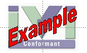

# Conformance

IVI drivers that conform to either the IVI Core Driver standards or the IVI
Configurable Settings standard specifications and have been registered with the
IVI Foundation may display the IVI Conformant logo.

See the [Driver Registry \> Register Your
Driver](../DriverRegistry/DriverRegistration.html) page to register your driver.
You will receive an email containing the Logo file when you complete the
registration process.

**IVI Conformant Logo**

IVI members may also display the standard IVI logo in association with
Instruments or software applications that are IVI-related or IVI-enabled.

