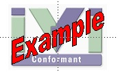

# Conformance

IVI drivers that conform to and are documented according to the IVI
specifications may display the IVI Conformant logo for easy
identification. Drivers must also be registered before the logo can be
used. See the [Driver Registration \>
Registration](../registered_drivers/register_driver.html) page to
register your driver. You will receive an email containing the Logo file
when you complete the registration process.

  
IVI Conformant Logo

 

  

IVI members may also display the standard IVI logo in association with
Instruments or software applications that are IVI-related or
IVI-enabled.
